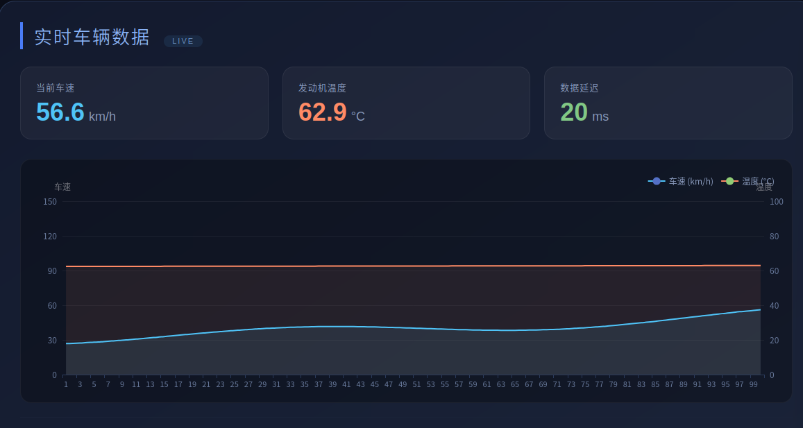
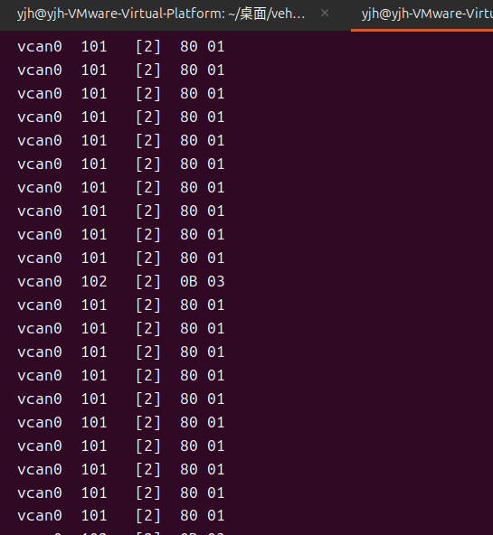
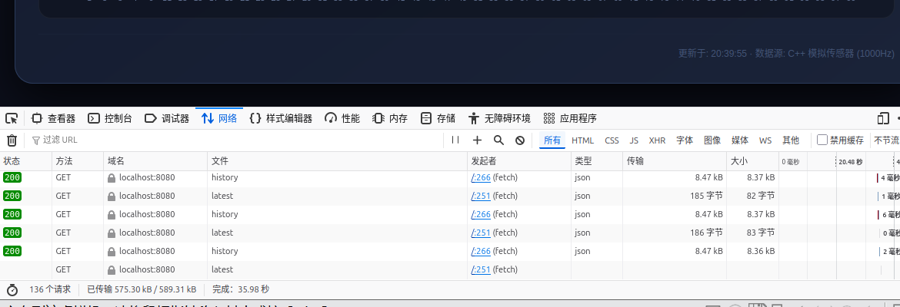
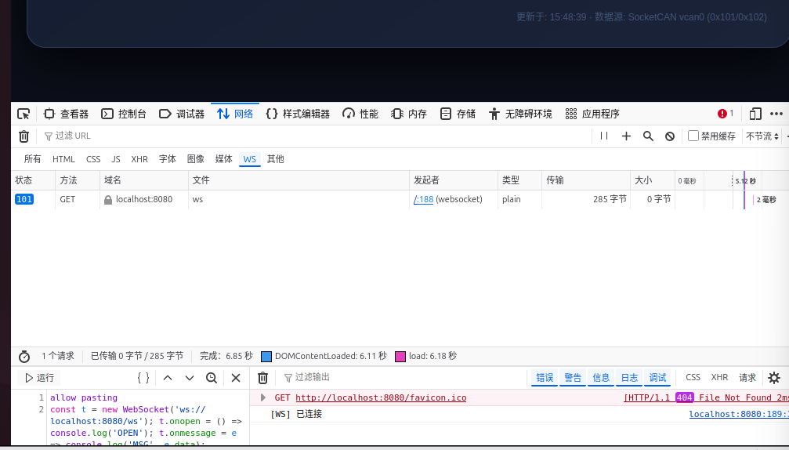
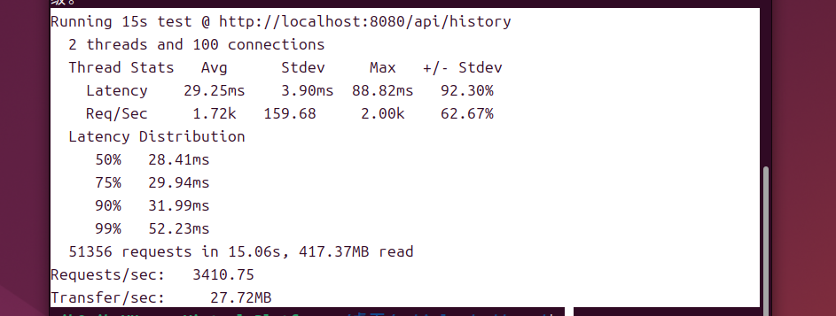
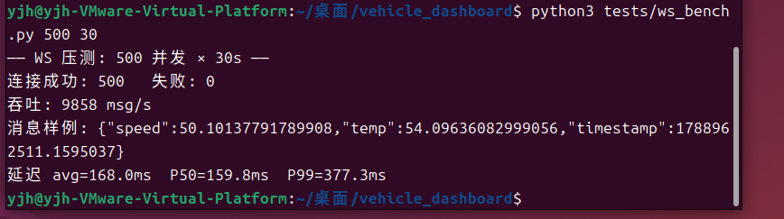
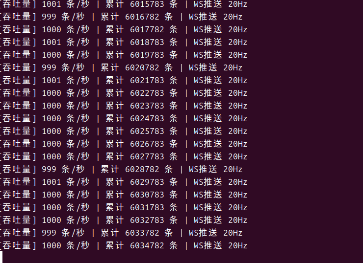

# 车载数据实时监控仪表盘


从 Linux 内核 SocketCAN 到浏览器曲线的完整链路。模拟车载 ECU 通过 CAN 总线发帧，中间件用 PF_CAN RAW socket 收帧、内核层按 ID 过滤，解析后经无锁队列与发布订阅总线分发，最终以 20Hz 通过 WebSocket 推送到浏览器实时渲染。



数据源是 vcan0 上的 0x101 / 0x102 报文。延迟卡片 = `Date.now() - 帧时间戳`，前端与服务端在同一台虚拟机内，时钟口径一致，数字里包含 20Hz 推送节拍的等待时间。

## 数据流

```
can_producer
    |  550 帧/秒（0x101 每 2ms，0x102 每 20ms）
    v
vcan0  (SocketCAN 内核)
    |  PF_CAN RAW + CAN_RAW_FILTER
    v
can_source_thread   0x101 / 0x102 各持最新值 -> 合成一条 DataPoint
    |
    +--> DataPool --------------------------> GET /api/history（冷启动回填）
    |         1ms drain + 降采样
    |
    +--> TopicBus.publish(Topic::Telemetry)
              |  独立分发线程，每个订阅者一条私有 BlockingQueue
              +--> ws_q    (8192) --> 20Hz 合并 + loop->defer() --> uWS publish --> 浏览器
              +--> alarm_q (1024) --> 车速 > 130 km/h --> LOG_WARN
              +--> net_q   (4096) --> NetReporter --> TCP 9000（指数退避重连）
```

Logger 是第四个消费端：各线程只把日志字符串塞进无锁队列，落盘由独立线程完成。

## 核心组件

| 组件 | 作用 |
|------|------|
| `MpmcQueue` | 多生产者多消费者无锁环形队列（Vyukov 算法） |
| `BlockingQueue` | MpmcQueue 的阻塞包装，空闲时 `condition_variable` 挂起 |
| `TopicBus` | 发布订阅总线，独立分发线程，订阅者各持一条队列 |
| `DataPool` | 历史数据池 + 降采样，供 `/api/history` 冷启动 |
| `Logger` | 异步日志，入队方纳秒级返回 |
| `NetReporter` | TCP 上报，指数退避重连 |

## 快速开始

```bash
# 依赖（Ubuntu 24.04）
./scripts/install_deps.sh

# 终端 1：虚拟 CAN 总线 + 模拟 ECU
./scripts/setup_vcan.sh
./build/can_producer

# 终端 2：启动服务
cmake -B build -DCMAKE_BUILD_TYPE=Release
cmake --build build -j$(nproc)
./build/dashboard --can vcan0

# 浏览器打开 http://localhost:8080
```

不带参数启动时使用内部模拟源（1000Hz）；`--can` 指定的总线起不来会自动回退。`./build/dashboard --bench` 跑队列基准。

## Docker

```bash
docker build -t vehicle-dashboard .
docker run --rm -p 8080:8080 vehicle-dashboard
```

镜像默认 `CMD` 是 `dashboard --can vcan0`，容器内没有 vcan0 时同样回退到内部模拟源。

## CAN 报文协议

| ID | 周期 | 信号 | 解码 |
|----|------|------|------|
| 0x101 | 2 ms | 车速 | `data[0..1]` 小端 uint16，raw / 10 = km/h |
| 0x102 | 20 ms | 水温 | `data[0..1]` 小端 uint16，raw / 10 = °C |

两个 ID 分帧到达，中间件各持最新值合成一条输出，前端只看到一条时间线。



上图里 `vcan0 101 [2] 80 01` 即 `0x0180 = 384 → 38.4 km/h`，`vcan0 102 [2] 0B 03` 即 `0x030B = 779 → 77.9 °C`。101 与 102 的行数比约为 10:1，对应 2ms 与 20ms 的发送周期。

## WebSocket 推送

早期版本是前端 `setInterval(500ms)` 同时轮 `/api/latest` 和 `/api/history`，换成 uWebSockets 后同一页面的网络面板对比如下。

轮询：36 秒内 136 个请求，两个接口交替，每次 history 响应 8.4 KB。



推送：WS 过滤器下只剩一条 101 Switching Protocols 的长连接，控制台 `[WS] 已连接`。



| 指标 | 500ms 轮询 | WebSocket |
|------|-----------|-----------|
| 36 秒请求数 | 136 | 1 条长连接 |
| 单客户端带宽 @20Hz | ~168 KB/s | ~2 KB/s |
| 端到端延迟 | 71~163 ms | 20~30 ms |
| 服务端序列化 | 每请求一次，O(客户端数) | 每 tick 一次，O(1) |

## 性能数据

测试环境：VMware 虚拟机 / Ubuntu 24.04 / 2 vCPU。所有数字都是这台机器实测，非裸金属，偏保守。


| 项目 | 结果 |
|------|------|
| SPSC 队列（1P1C） | 7.46 M items/sec |
| MPMC 队列（1P1C） | 5.27 M items/sec |
| MPMC 队列（4P4C，800 万条） | 10.88 M items/sec，零丢失 |
| CAN 链路 | ~550 条/秒 |
| HTTP `/api/history`（wrk -t2 -c100 -d15s） | 3410 QPS，P50 28.4ms，P99 52.2ms，0 错误 |
| WebSocket（500 并发 / 30s） | 9858 msg/s，P50 159.8ms，P99 377.3ms，零丢包 |
| 长稳 | 1000Hz 内部源连续运行，累计 603 万条无中断 |

HTTP 压测原始输出：



WebSocket 压测原始输出（`tests/ws_bench.py`，单进程 asyncio 客户端）：



dashboard 每秒打印一次吞吐，长跑期间稳定在 1000 条/秒、WS 推送 20Hz：



MPMC 单线程比 SPSC 慢 29% 是预期内的，CAS 比纯原子 load/store 贵。多核时反过来：2 vCPU 上 4P4C 相对 1P1C 提升约一倍（5.27 → 10.88）。完整报告见 `docs/benchmark.md`。

## 关键实现

**无锁队列**：SPSC 用两个原子游标 + acquire/release 内存序；MPMC 用 Vyukov 算法，CAS 抢占槽位，每槽带单调递增序号，规避 ABA 和半成品可见性。`alignas(64)` 隔离伪共享。

**发布订阅**：数据源只调 `publish(Topic, 数据)`，不知道有多少订阅者。分发线程查 Topic 对应的订阅者列表，给每个订阅者的队列 push 一份。`deliver` 在锁内快照订阅者列表、锁外执行回调，避免持锁调回调死锁。

**阻塞唤醒**：`BlockingQueue` 空闲时消费者用 `condition_variable` 挂起，不占 CPU；数据到即唤醒。替代 1ms 轮询后，`top -bn1 -p $(pgrep dashboard)` 采 10 秒均值，dashboard 进程 CPU 从 ~15% 降到 ~10%。

**内核态 CAN 过滤**：`CAN_RAW_FILTER` 只放行 0x101/0x102，其余报文不进用户态。

**线程安全广播**：uWS 是单线程事件循环，工作线程通过 `loop->defer()` 把 `publish` 投递回事件循环线程执行。

## 故障演示：总线冻结实验

断开 `can_producer` 后前端曲线保持最后有效值、页面不崩溃；重启生产者后曲线立刻恢复。这和真车 ECU 掉线时仪表的行为一致——链路故障被隔离在数据层，而不是整站崩掉。

## 网络上报

```bash
# 终端 1：mock TCP 服务器
python3 tests/mock_server.py 9000

# 终端 2、3：CAN 生产者 + dashboard（同上）
```

mock server 持续收到 JSON，速率与 CAN 帧同步（约 550 行/秒）：

```
{"timestamp":1789268652086,"speed":59.3,"temp":74.1}
```

断线按 1s→2s→4s→8s→16s→30s 指数退避重连；连接中断由 `send()` 返回的 `EPIPE`/`ECONNRESET` 检测。

## 测试与 CI

```bash
cmake -B build -DCMAKE_BUILD_TYPE=Release
cmake --build build -j$(nproc)
cd build && ctest --output-on-failure
```

三个单元测试：`test_ring`（队列正确性）、`test_topic_bus`（订阅分发与句柄生命周期）、`test_data_pool`（降采样与容量边界）。GitHub Actions 在 `ubuntu-24.04` 上每次 push 自动编译并跑 ctest。

## 目录结构

```
├── include/
│   ├── mpmc_queue.hpp       MPMC 无锁队列（Vyukov）
│   ├── ring_buffer.hpp      SPSC 无锁环形队列
│   ├── blocking_queue.hpp   MPMC + 条件变量阻塞包装
│   ├── topic_bus.hpp        发布订阅总线
│   ├── data_pool.hpp        历史数据池 / 降采样
│   ├── logger.hpp           异步日志
│   ├── net_reporter.hpp     TCP 上报
│   └── timestamp.hpp        强类型时间戳（毫秒）
├── src/
│   ├── main.cpp             服务端：CAN 收帧 + TopicBus + REST + WS
│   ├── data_generator.cpp   内部模拟源（CAN 不可用时兜底）
│   └── can_producer.cpp     CAN 帧生产者（模拟 ECU）
├── tests/
│   ├── test_ring.cpp
│   ├── test_topic_bus.cpp
│   ├── test_data_pool.cpp
│   ├── bench_mpmc.cpp       SPSC / MPMC 吞吐对比
│   ├── ws_bench.py          WebSocket 并发压测
│   └── mock_server.py       TCP 上报 mock
├── scripts/
│   ├── install_deps.sh
│   └── setup_vcan.sh
├── docs/
│   ├── benchmark.md         完整压测报告
│   └── screenshots/         本文引用的实测截图
└── www/index.html           前端（ECharts）
```

## 开发中踩过的坑

**时间戳口径不一致**：模拟源用秒，CAN 源用毫秒，降采样窗口直接失效。统一改成毫秒，并引入 `Timestamp` 结构体把取时收敛到唯一出口，单位错误从运行期提到编译期。

**deliver 持锁调回调**：回调里再调 `subscribe` 会死锁。改成锁内快照订阅者列表，锁外执行。

**2 vCPU 忙等饿死事件循环**：4 个 `while + yield` 线程把两个核占满，uWS 主线程收不到新的 WS 连接。先用 1ms sleep 止血，再用 `BlockingQueue` 做正经方案。

**Docker 内 CMake 缓存污染**：宿主机 `build/` 被 COPY 进镜像，CMakeCache.txt 指向宿主机路径。加 `.dockerignore` 排除。

## 常见问题

**为什么用无锁队列而不用 mutex？**
SPSC 是固定拓扑，两个原子游标即可零锁同步；MPMC 用 CAS 分担竞争。mutex 在高频下有锁竞争和上下文切换开销，尾延迟不可控。

**550 帧/秒需要无锁队列吗？**
当前流量不大，基准测试给出的是设计余量。真实整车多 ECU 汇聚后帧率会放大，数据通道不该成为第一个瓶颈。

**为什么不用 ECharts 的 time 轴？**
当前用 category 轴配合序号，曲线在视觉上均匀。timestamp 目前用于延迟显示和 `/api/history` 排序，切到 time 轴需要把数据格式改成 `[timestamp, value]`。